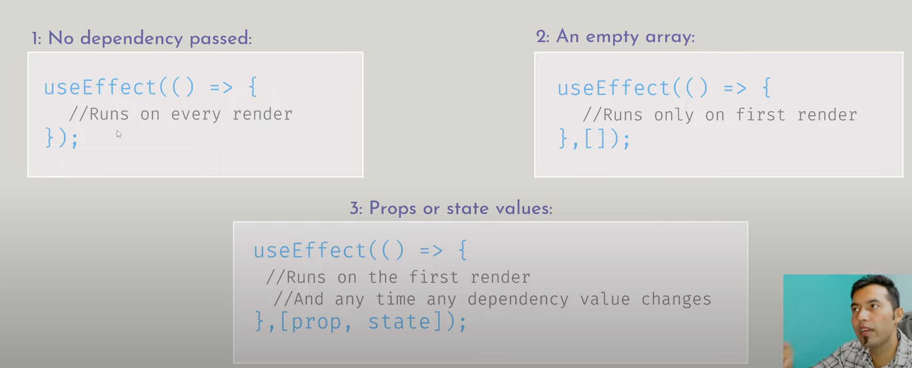

# Hook rules 

1. You must import Hooks from react.
2. Hooks can be called inside React function components.
3. Hooks can only be called at the top level of a React component.
4. Hooks cannot be conditional. 

const [count, setCount] = useState(0);
        |        |            | 
        |        |            |
      state    updated      initial
    variable   function      
    
===========================================================================

# useEffect

useEffect(( => {}, [dependency])) 
            |           | 
            |           |
    callback fun.      array 
     we write side    dependency
     effect code      
     

===========================================================================
